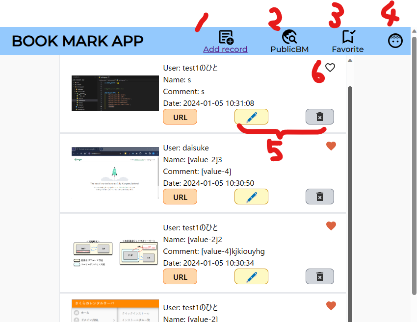
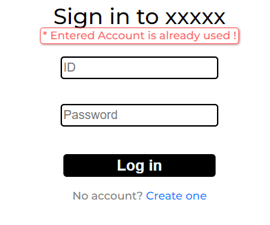
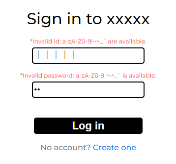
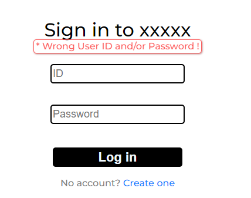
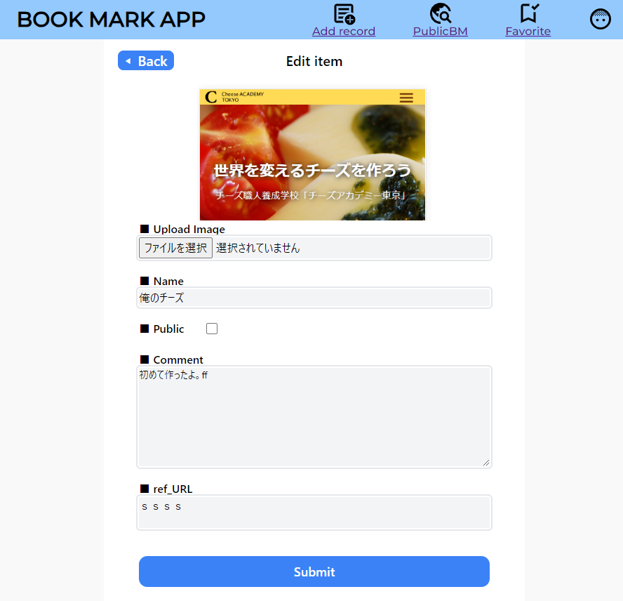
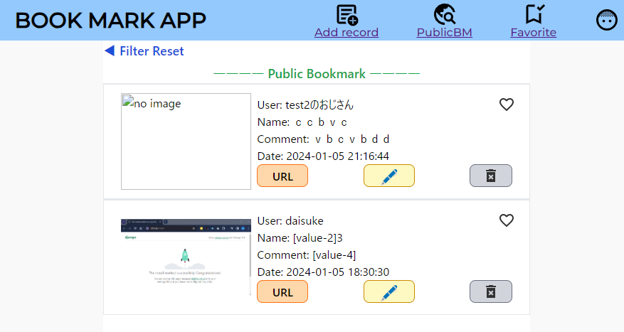
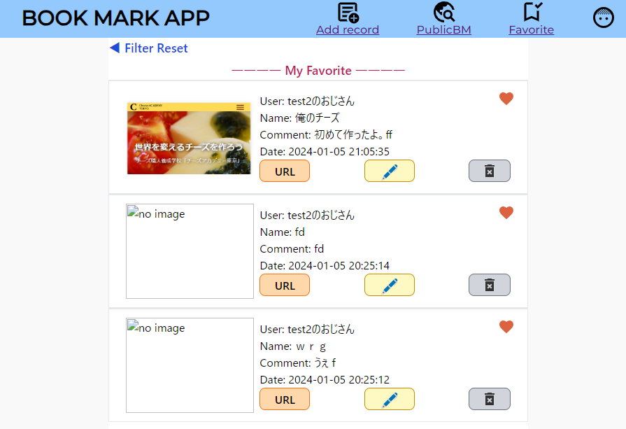
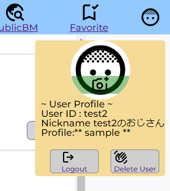

# アプリ名：ブックマークシェア＋ユーザー登録

***

## アプリの概要

- ユーザー情報(ユーザーID、パスワード、ユーザー表示名)を登録する機能を実装
- 登録したユーザーID、パスワードを使用した、ログイン・ログアウト機能を実装
- ログインしているユーザーの表示名をブックマーク情報に含めた状態で保存できる
- ユーザーお気に入り登録ができる

## 使用方法
 1. **ユーザー登録**：ユーザーID、パスワード、ユーザー表示名を入力し、登録ボタンをクリック。<br>**⇒submit時にvalidation+DB照合が行われエラーが表示される**
 1. **ログイン**: ユーザーID、パスワードを入力しボタンをクリック。<br> **⇒⇒submit時にvalidation+DB照合が行われエラーが表示される**
 1. **ブックマーク登録**: 登録内容を明記しボタンをクリック<br> 
 1. ブックマークのブックマークが可能

## メイン画面

1. ブックマークの追加
1. 他のユーザーがpublic公開しているbmを身に行ける(フィルタリング未完成)
1. 6でお気に入り登録しているもののみをフィルタリング
1. 簡易版ユーザー情報。ログアウトはこちらから。
1. 編集＆削除

## 苦労したところ
 - ログインに必要な情報集める際、
    - 入力値のbind有無
    - パスワードのhash化(`password_verify/password_hash関数`)
    - ログインしているユーザーの情報をどう取得するか(`session_start/$_SESSION=[]`)
    - phpのページの分割単位

    等の情報が、紹介されている記事によってまちまちであったため、内容を読み取り、自分のアプリ向けにカスタマイズするところが大変だった。<br>**⇒結果として理解度は高まった。**
 - ユーザー登録・ログインのUIデザイン・挙動を既存のサービスのモノを参考に再現を試みた。<br>POST時に各種ステータス情報を送ることで、ログイン時のバリデーション結果や、ユーザー登録の成否を切り替えて表示する仕様にした。<br>画面遷移をFadeInでスムーズにすることでログイン/登録画面UIの切り替えが発生していることを知らせることができる。

 - 基本のCRUD操作を簡単に行うためのクラスを作成(dsSqlSimple.php 内)<br>データベース接続～バインド処理～実行に至るまでの一連の操作を最小限の入力で行えるようにしてみた。クラスの勉強をすることで`->`,`=>`,`::`の意味が分かりやすくなり、良かったと思う。以下、使用例を記す。<br>

### 使用例　気になる方はソースを見てみてください。
※このあとララベルの学習が始まるので実用性はそんなにないです。
ただ、クラスのイメージは知っておいて損はないかも…？あとたのしい。
1. インスタンス生成(引数はDB名)
```php
 $sql = new sqlDB_cls("gs_bm_table_2");
```
2. テーブル指定等ORDER_BY等設定
```php
$sql->set_prop('table','user');
```
3. 各種引数の準備 基本的に連想配列でDB操作を指示する。
```php
// 例1 データベース追加用の連想配列を準備
$obj = [
      // ラベル => 設定値
     "user_id"=>"aaaa",
     "pass"=>"bbbb",
     "nickname"=>"cccc"
 ];
// 例2 データベース更新用の連想配列を準備　１と同じ
$chgobj = [
      // ラベル => 設定値
    "user_id"=>"aaaa2",
     "pass"=>"bbbb2",
     "nickname"=>"cccc2"
];

```
4. SQL文の実行
```php
//$objの情報を持ったデータを追加する【INSERT】
$sql->set($obj);

//*id=1 に対し、$chgobjに基づいた変更を加える【UPDATE】
$sql->upd("id",1,$chgobj); 

//*id=2のレコードを削除【DELETE】
$sql->delete("id",2);

// *id=$idのユーザー情報を取得【SELECT】
$sql = new sqlDB_cls("gs_bm_table_2");
$sql->set_prop('table','user'); 
$results = $sql->get("*",["id"=>$id]);
// *複数条件での検索の場合デフォルトはANDで動作する。$where_operator=”AND・”"OR"が選べる
```    


---

# 機能まとめ

---

### ログインユーザー登録
- すでに登録されているユーザーidはメッセージが出て新規登録させない
- 簡単な正規表現を使った、入力記号の制限、メッセージ

- ログイン失敗時のアラート


### メイン画面
- iframeを使用した、画面内でのブックマーク一覧の表示 (更新タイミング早い順)
- ブックマーク追加ボタン->入力画面
- ブックマーク編集ボタン->上記の流用(URLパラメータで処理を分岐)<br>画像のアップロード機能を実装。input[type=file]はvalueを受け取れない仕様のため、非表示のinput[type-text]を別途用意し、ファイルパスを預けることにした。編集時に何も添付しなくても画像が維持されるようにした。(セキュリティ的にやっていいことなのかは不明)<br>
- ブックマーク削除機能->YES/NO確認ののち削除を実行
- お気に入りボタン(ハート)
- 参照リンクボタン->編集から登録しておくとリンクが新しいタブで開かれる
- フィルター機能
  - Public BM (ユーザーがパブリック公開しているBMを表示<br>
  - Favorite (ユーザーがお気に入り登録したBMを表示)<br>
  - ◀ Filter Reset (デフォルト状態に戻る＝ユーザーのBMのみ表示)
- ログアウト機能(坊主の少年アイコンから。DeleteUserは似たような処理になるので、スキップ。ログアウトと同じ挙動となっている)<br>

## 課題
 - xssとインジェクション対策は実施したが、閲覧権限関係の処理がちゃんと入れられていない。(できたらやりたい)
 - 並行してDjangoを触ってみてますが、どっちで行こう…さすがフレームワーク。とりあえずララベルに期待。
 
